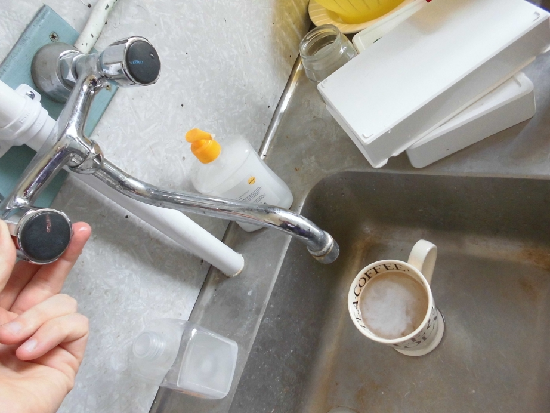
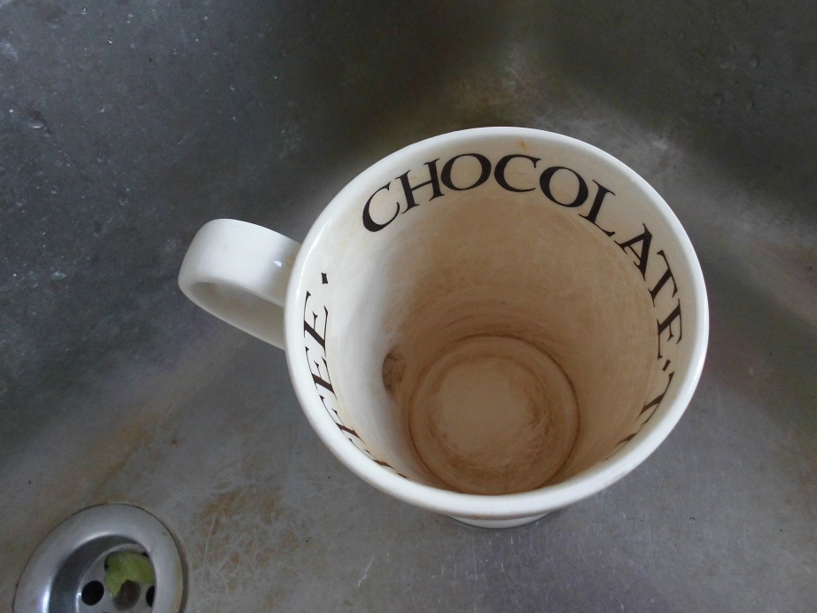
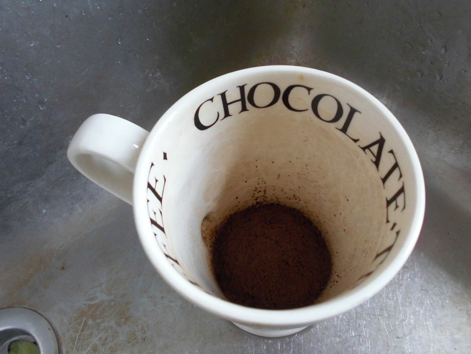
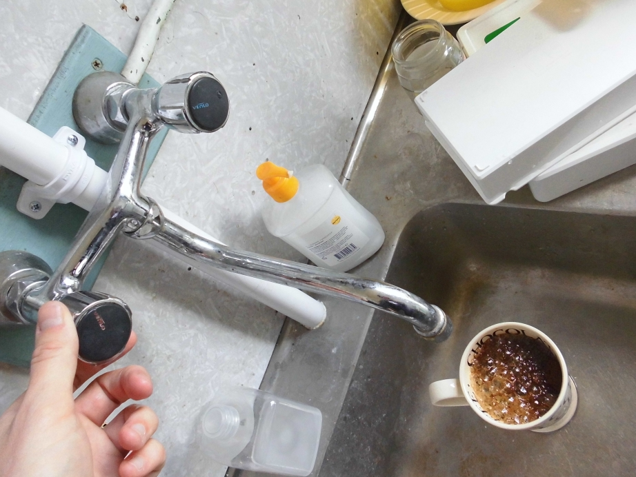
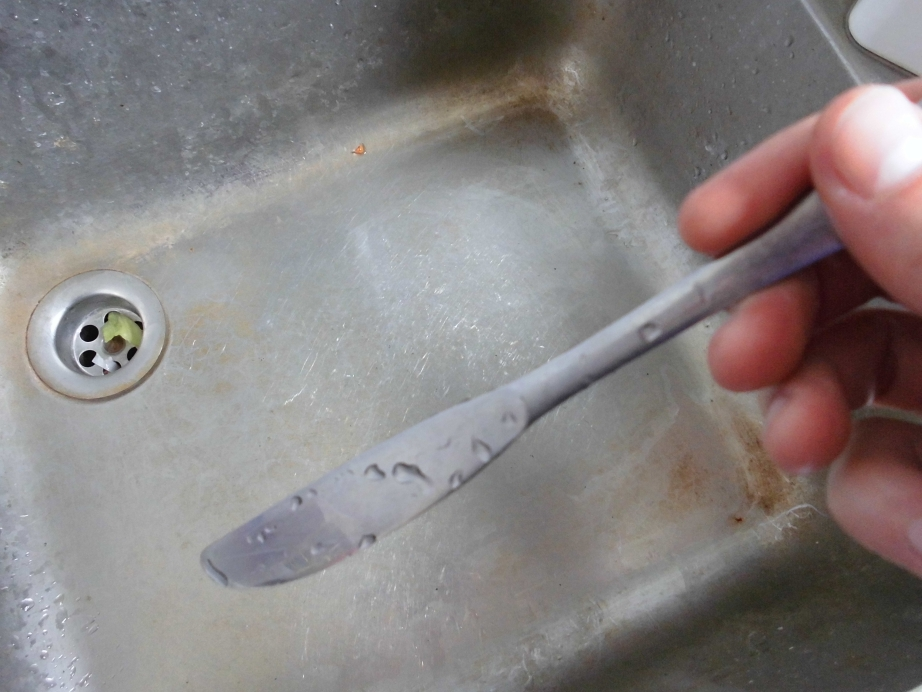
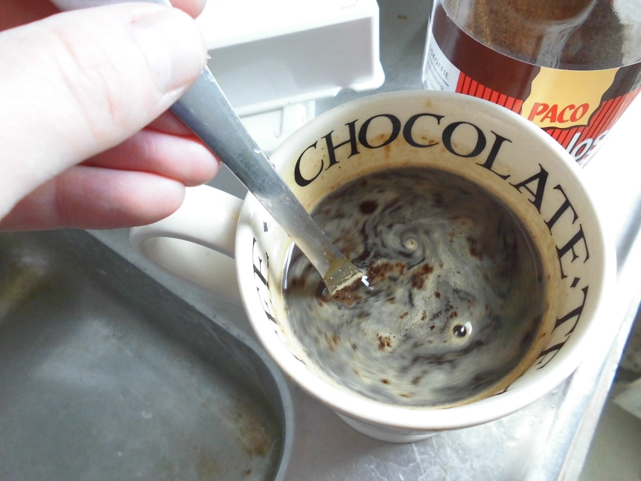
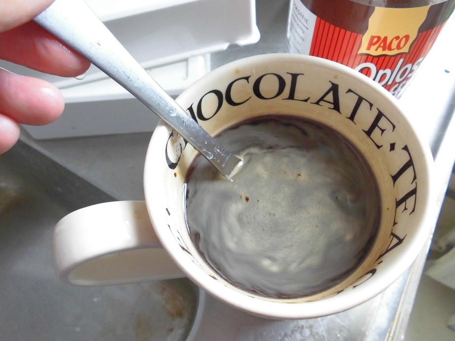
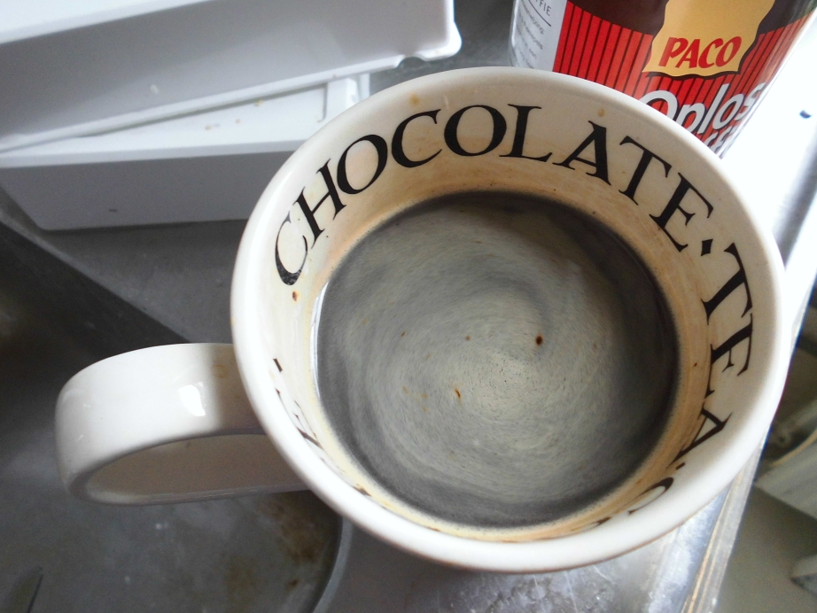

# EasyCoffee

Guide to make excellent coffee in one minute without using specialized machines.

You can also read the [FAQ](FAQ.md).

Or download the [PDF](EasyCoffee.pdf).

## Pre-heat the cup

I like to pre-heat the cup by putting hot water from the tap in it. This step can be safely omitted, as it won't significantly affect the taste.

## Empty the cup

Empty the cup. Cleaning it thoroughly is optional, as it won't significantly affect the taste.

## Add instant coffee powder

Just add instant coffee powder. I fill my cup up with about 15% coffee powder. Adding less coffee powder results in a more watery coffee with less caffeine. Adding more coffee powder results in coffee with a strong coffee taste and more caffeine.

## Add hot water from the tap

Fill the cup (with coffee powder) with hot water from the tap. Because I prefer hot coffee, I like to let the tap run water until it becomes hot, but that can be safely omitted, as it won't significantly affect the taste.

## Find something to stir the coffee with

Find something to stir the coffee with. In this example, I use a knife, but any piece of cutlery can be used. I like to clean the stirrer, but that can be safely omitted, as it won't significantly affect the taste.

## Stir the coffee

Stir until the flakes are homogenized. This is about 10 seconds for me. If you like flakey coffee, this step can be safely omitted, as it won't significantly affect the average taste.

## Visual check

After stirring, check visually if all flakes are homogonenized. If not, go back to the previous step. This step can be safely ommited, as it won't significantly affect the average taste.

## Enjoy!

Your excellent coffee is done! Thanks to this guide you can now make the perfect coffee within one minute without using specialized machines!

If you have any questions, you can read the [FAQ](FAQ.md).
